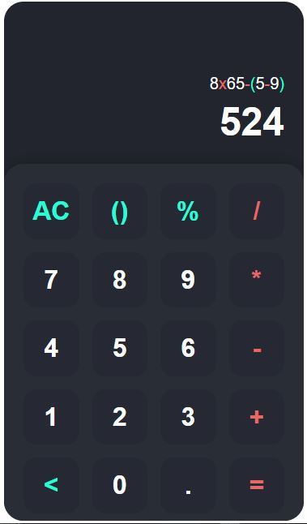

# 🧮 Web Calculator

A simple, responsive calculator built with **HTML**, **CSS**, and **JavaScript**.
It supports basic arithmetic operations, parentheses, percentages, and proper formatting of input/output.

---

## 🚀 Features

- ✅ Addition, subtraction, multiplication, division
- ✅ Parentheses `()` handling with automatic balancing
- ✅ Percent calculations (`%`)
- ✅ Decimal support
- ✅ Clear (`C`) and Backspace (`⌫`) functionality
- ✅ Formatted output with commas for thousands
- ✅ Responsive design (works on desktop and mobile)
- ✅ Styled operators and brackets for better readability

---

## 📂 Project Structure


calculator/
│
├── index.html      # Main HTML file
├── style.css       # Styles for calculator UI
├── script.js       # Calculator logic (input handling, formatting, evaluation)
└── README.md       # Project documentation


## ⚡ Installation & Usage

1. Clone the repository:
  ```bash
  git clone https://github.com/droidevs/calculator.git
  ```

2. Open the project folder:
   ```bash
   cd calculator
   ```

3. Open `index.html` in your browser:

   ```bash
   open index.html
   ```

   *(or just double-click it on Windows/Mac)*


## 🖼️ Preview



---

## 🛠️ Technologies Used

* **HTML5** – Structure of the app
* **CSS3** – Styling and layout (Flexbox + Grid)
* **Vanilla JavaScript (ES6)** – Core calculator logic

---

## 📌 Possible Improvements

* Add **keyboard support** for input
* Add **scientific functions** (sin, cos, log, etc.)
* Improve **error handling** (e.g., invalid expressions)
* Add **history of calculations**

---

## 👨‍💻 Author

Developed by **Mouad OUMOUS**
Feel free to fork this repo, open issues, or submit pull requests!

---

## 📜 License

This project is licensed under the **Apache 2.0 License** – you can use, modify, and distribute it freely.

